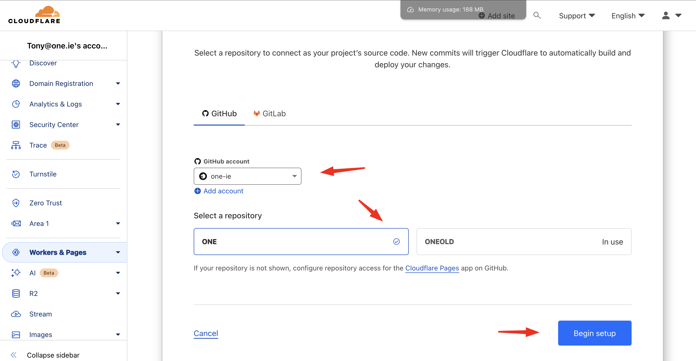

# Deploying Your Site on Cloudflare: A Step-by-Step Tutorial

Astro is a modern web framework for building fast, content-focused websites. Server-Side Rendering (SSR) enhances its performance by pre-rendering pages on the server. Deploying Astro with SSR on Cloudflare leverages Cloudflare's edge network for even faster delivery. Here's how to do it:

## Step 1: Build Your Astro Project

Build your project to ensure everything is working correctly:

```bash
pnpm run build
```

This command generates a `dist` directory with your server-side rendered site.

## Step 2: Create a New Cloudflare Account

## Step 3: Create a Cloudflare Worker
- Go to your Cloudflare dashboard and click on Workers and Pages.
- Click Create Application
- Click on the Pages tab
- Click connect to Github

## Step 4: Connect Your Worker to Your Project on Github
Select a repository to connect as your project’s source code. New commits will trigger Cloudflare to automatically build and deploy your changes.
If you can't see your account click add 


## Configure automatic builds and deployments 
Select Astro as the preset
Click Save and Deploy


## Add Your Domain
Click custom domains


## Configure Nodejs Compatability
Go to your project
Click Settings > Functions
Scroll down to Compatability Flags
Compatibility flags
Specify which Workers runtime compatibility flags you want the Functions in your project to use.
Click configure compatabilty flags
Add nodejs_compat to the list of Flags

2. **Visit Your Deployed Site:** After the deployment, Wrangler will provide a URL to view your deployed site.

## Step 7: Verify and Monitor

- **Verify Deployment:** Visit the provided URL to ensure your Astro site is live.
- **Monitor Performance:** Utilize Cloudflare's analytics to monitor your site's performance.

## Conclusion

Deploying Astro with SSR on Cloudflare is a straightforward process that brings the speed and reliability of Cloudflare's edge network to your Astro projects. This setup ensures your site is delivered with unparalleled speed, aligning perfectly with ONE's commitment to rapid, efficient, and innovative AI solutions.

For further assistance or to explore how ONE can accelerate your business with similar technologies, feel free to contact us at [tony@one.ie](mailto:tony@one.ie) or call us at +66660106632. Visit [ONE](https://one.ie/) for more information on how we can transform your business operations with the speed of light in the AI world.